\newpage

\tableofcontents

\newpage

# Instalación de Windows 10 
	
Vamos a ver todo el proceso de instalación de Windows 10, así como el primer arranque y puesta en marcha del sistema.

# Requisitos de Instalación
	
En la página web de microsoft nos indican algunas consideraciones que debemos tener en cuenta a la hora tanto de instalar como de actualizar desde versiones anteriores de Windows.

[Pagina de Soporte de Microsoft](https://www.microsoft.com/es-es/windows/windows-10-specifications#primaryR2)

Crearemos una máquina virtual que se ajuste a estos requisitos.

\newpage 

# Creación de la máquina Virtual

Crearemos ahora la máquina virtual de Windows en la que luego instalaremos utilizando la imágen que ya hemos descagado.

## Nombre de la máquina virtual

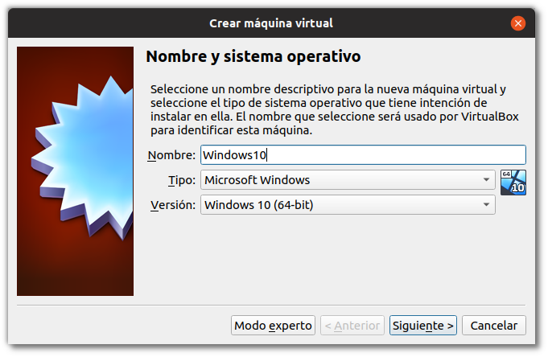

Al poner el nombre de **Windows10**, VirtualBox nos rellena los dos siguientes desplegables y nos los marca con *Microsoft Windows* y *Windows 10 (64-bit)*. Si deseamos cambar el sistema que nos propone basta con que seleccionemos nosotros lo que que mejor se acople de los desplegables.

## Memoria RAM

Asignaremos la memoria RAM recomendada en los requisitos (2048).

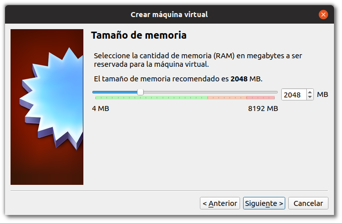

## Disco Duro

En el siguiente paso crearemos el disco duro que utilizaremos para instalar Windows 10.

No utilizaremos uno anterior.

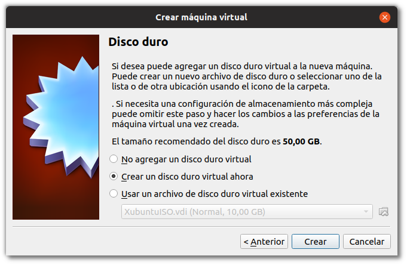

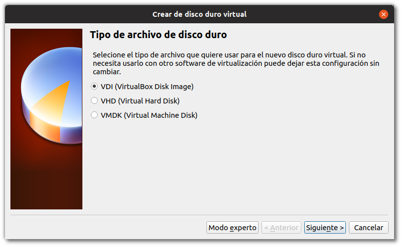

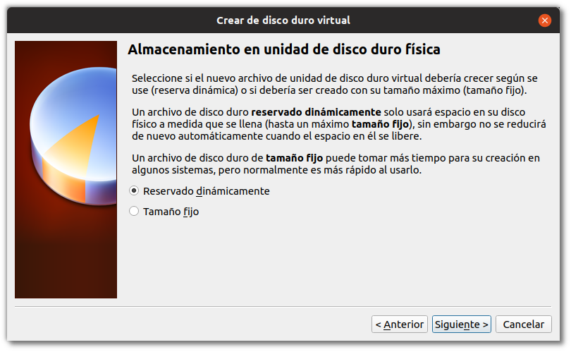

## Red 

Pondremos la red en NAT por ahora, ya que no vamos a conectar esta máquina a ninguna otra, tan solo queremos realizar tareas de configuración básicas.

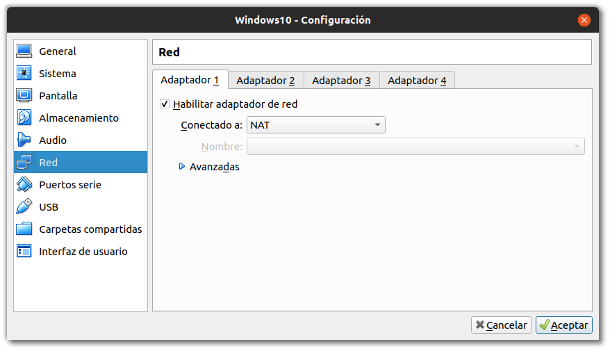

## Imágen ISO de Instalación

En el apartado de almacenamiento estableceremos que la imágen que nos hemos descargado de Windows 10 es la que vamos a utilizar para arrancar la máquina.

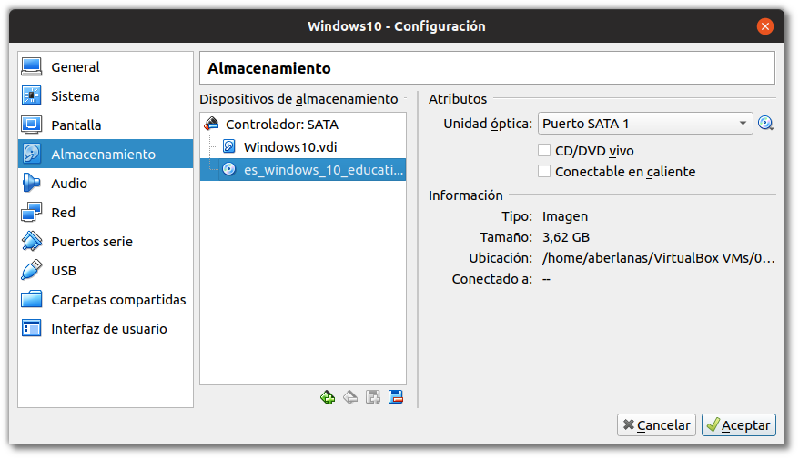

Con estos pasos ya tendremos preparada la MV para que instalemos Windows 10.

# Instalación de Windows 10

Arrancaremos la máquina virtual, y comenzará el proceso de instalación. Cabe destacar que al igual que nos ocurrió con Xubuntu, VirtualBox directamente sabe que no hay nada en el Disco Duro que tiene **conectada** la MV y nos lanza el proceso de instalación. Si esto lo hicieramos en una máquina Física, o cuando volvamos a arrancar una MV del VirtualBox que tiene discos duros instalados, aparece un mensaje que nos indica que debemos pulsar una tecla si queremos continuar el proceso de arranque desde el CD/DVD.

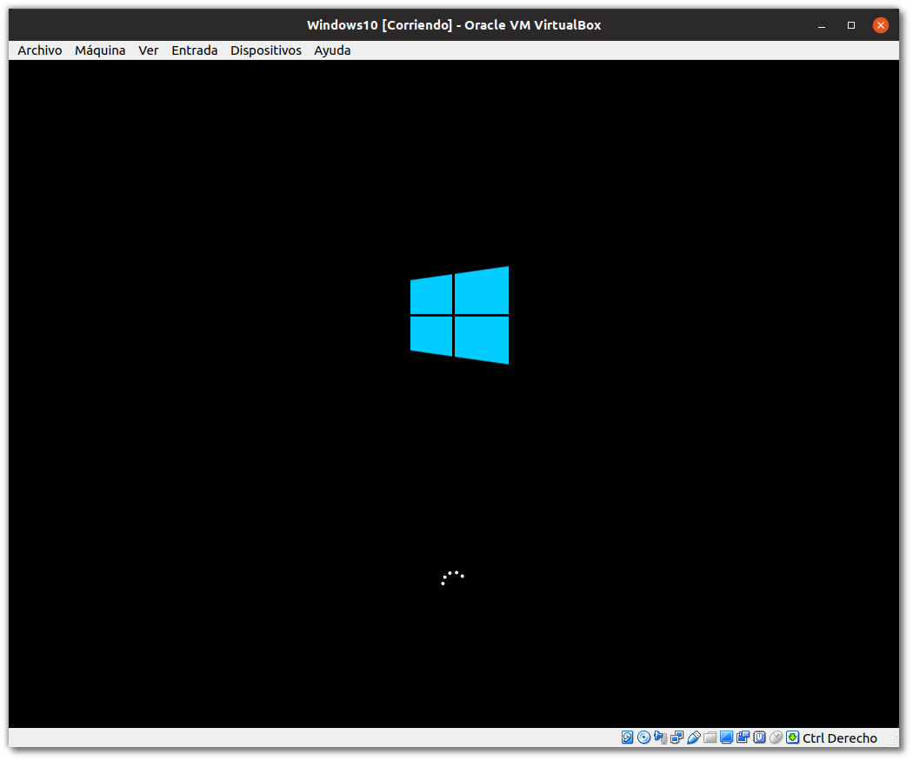

\newpage

## Selección de idioma

Debemos seleccionar el idioma en el que se va a instalar Windows.

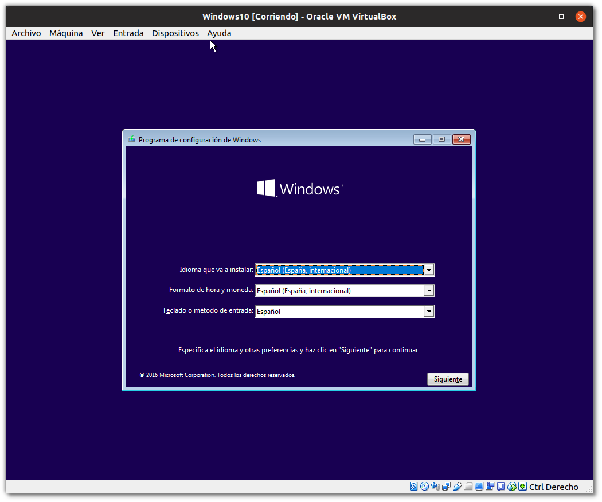

## Instalación

En esta ventana ahora seleccionaremos la opción de Instalar Ahora, pero si estuvieramos realizando tareas de rescate de Windows (arrancando con un DVD un ordenador que ya tuviera Windows Instalado), deberemos pulsar el botón que aparece en la parte inferior izquierda que nos permitirá *Reparar el equipo*.

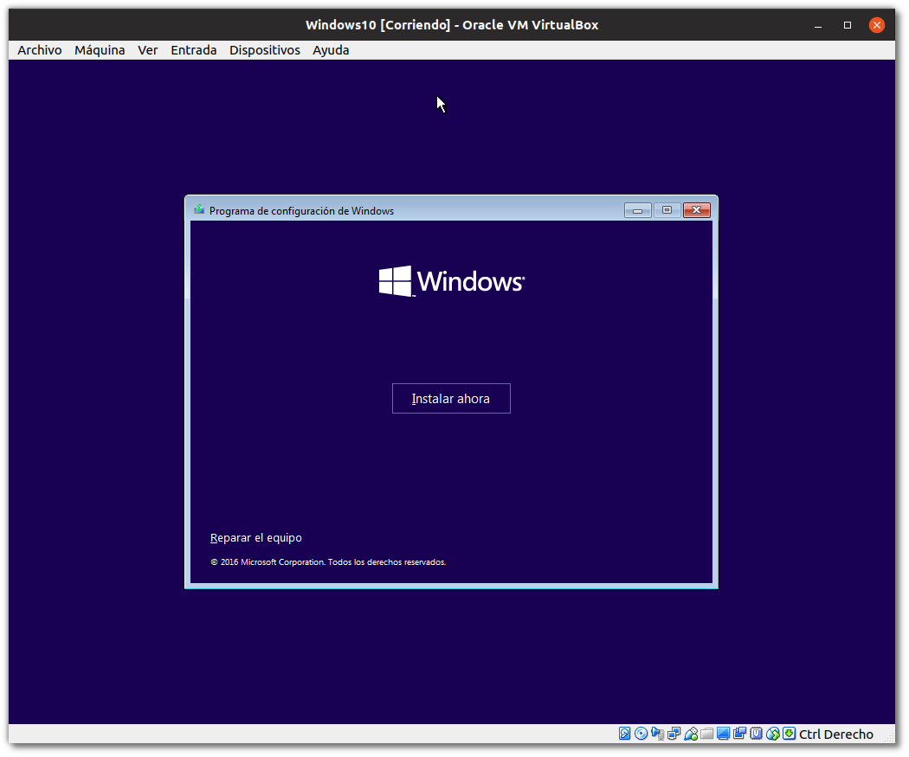

\newpage

## Activación de Windows

El siguiente paso es la activación de Windows, si tenemos una clave del Sistemas Operativo este es el momento de ponerla, en caso de que no la tengamos podemos seleccionar **No tengo clave de producto**. En caso de que pongamos una clave incorrecta, o que ya tengamos registrada en Microsoft, luego desde el panel de configuración del sistema podremos cambiarla o agregar una nueva.

\newpage

## Contrato de licencia de Usuario Final

Esto es el CLUF (*Contrato de Licencia de Usuario Final*) o en inglés *EULA* (*End User License Agreement*). Debemos leerlo al menos alguna vez...

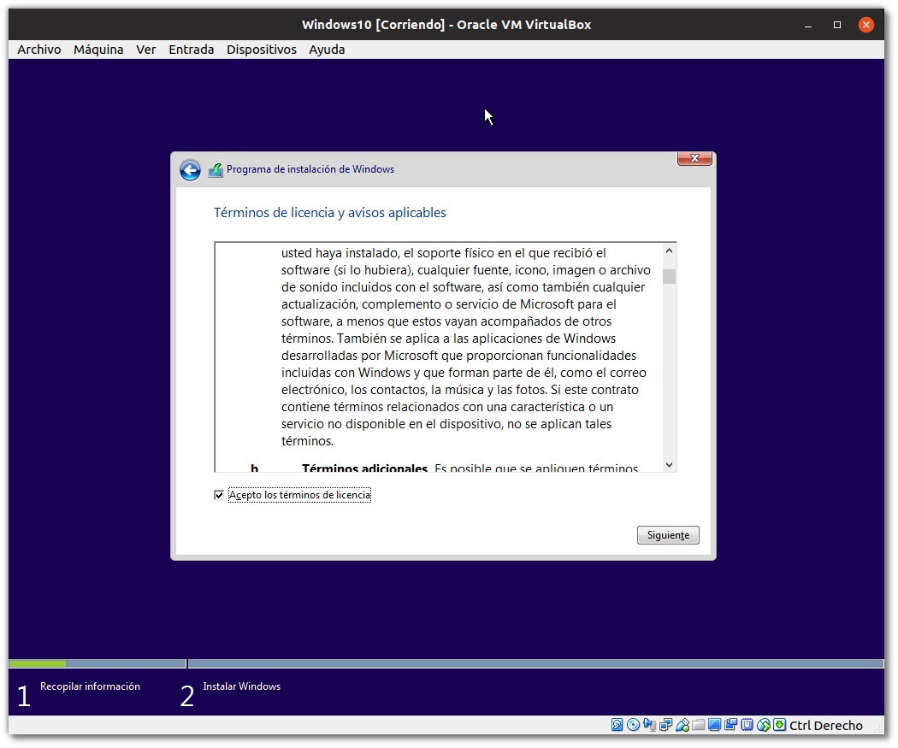

\newpage

## Particionado de discos

A continuación se nos muestran los discos y particiones que tenemos disponibles para la instalación de Windows. En este caso, al tener un disco totalmente vacio, basta con que seleccionemos el disco y pulsemos siguiente.

En esta ventana, si estamos haciendo una instalación dual debemos tener en cuenta que particiones están en uso, que tamñano tiene, etc.

Esto lo veremos más adelante en el módulo. 

	
\newpage

## Progreso de la instalación

A continuación nos aparecerá una ventana que nos va indicando los distintos pasos que debe realizar el proceso de instalación para completarse. 

Esta ventana es totalmente *desatendida*, y podemos ir haciendo otras cosas.

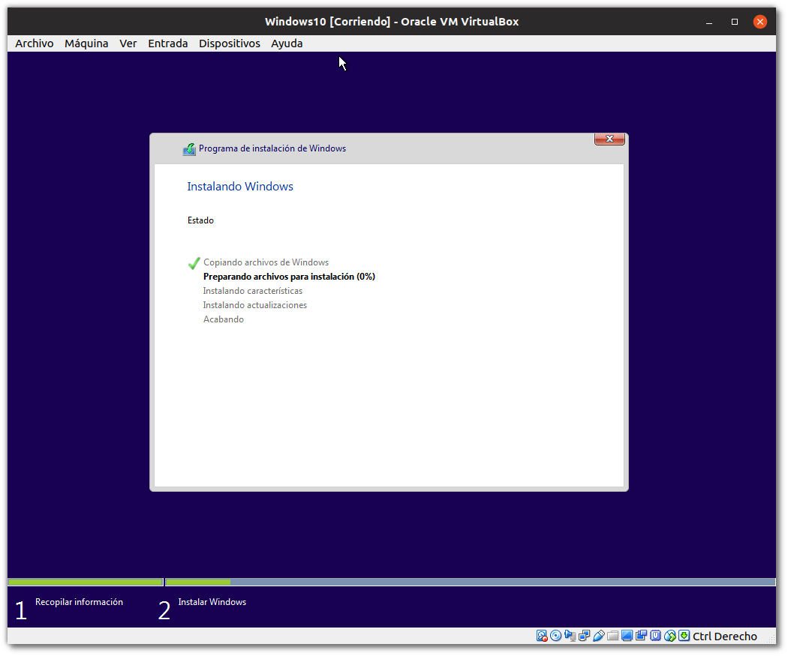

A continuación el sistema se reiniciará.

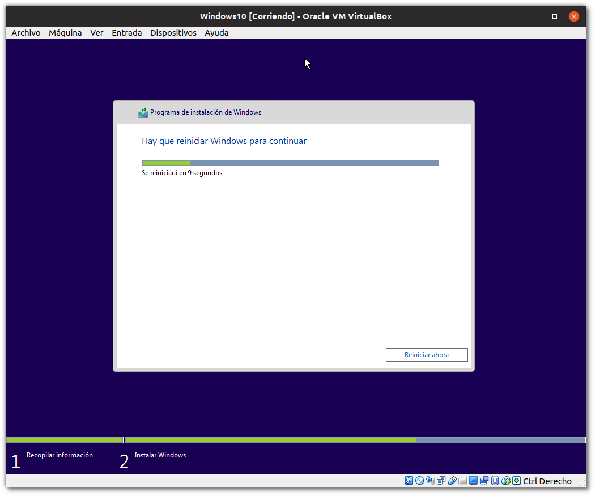

\newpage

## Primer arranque

Durante la instalación Windows se han copiado los ficheros desde el DVD/ISO al disco duro de nuestro equipo, sin embargo hay que configurar una serie de servicios y el usuario que será el administrador local del equipo. 

En este paso podemos utilizar la configuración rápida, pero para dar más control al usuario acerca de lo que escribe y como utiliza el sistema, vamos a deshabilitar los asistentes de Microsoft y todos los servicios de Ubicación, etc. 

Para ello utilizaremos el apartado de *Personalizar*.

En caso de que quisieramos utilizar los valores por defecto (todo activado), podemos utilizar la opción de *Usar la configuración rápida*.

\newpage

A continuación veremos las capturas de todas las opciones que se pueden deshabilitar para un mayor control del equipo.

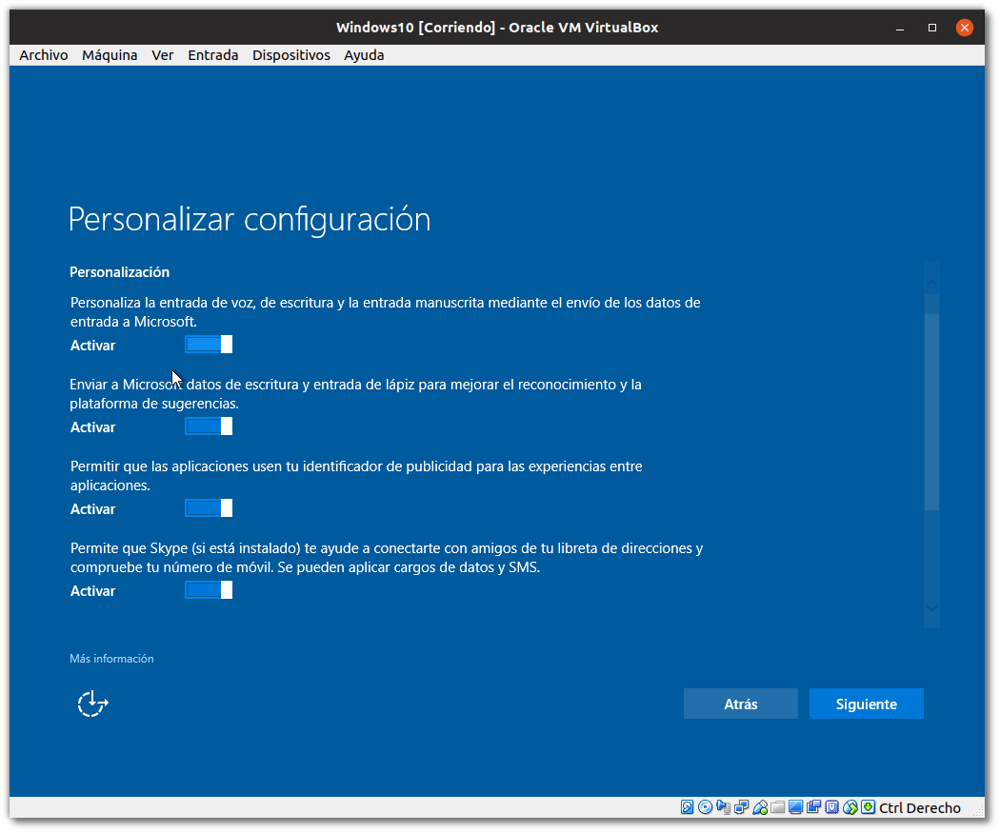

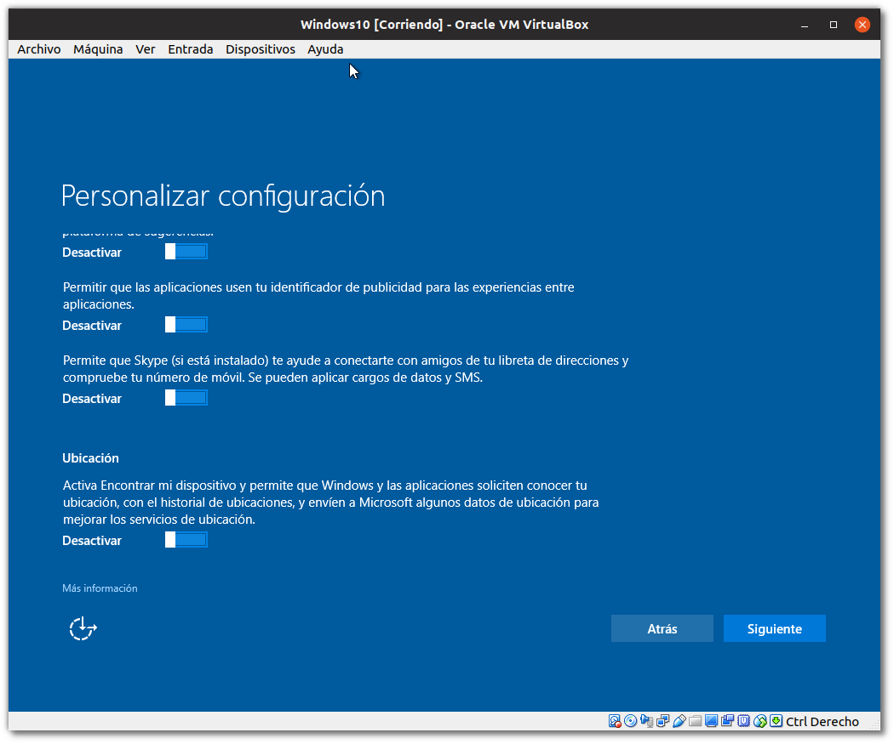

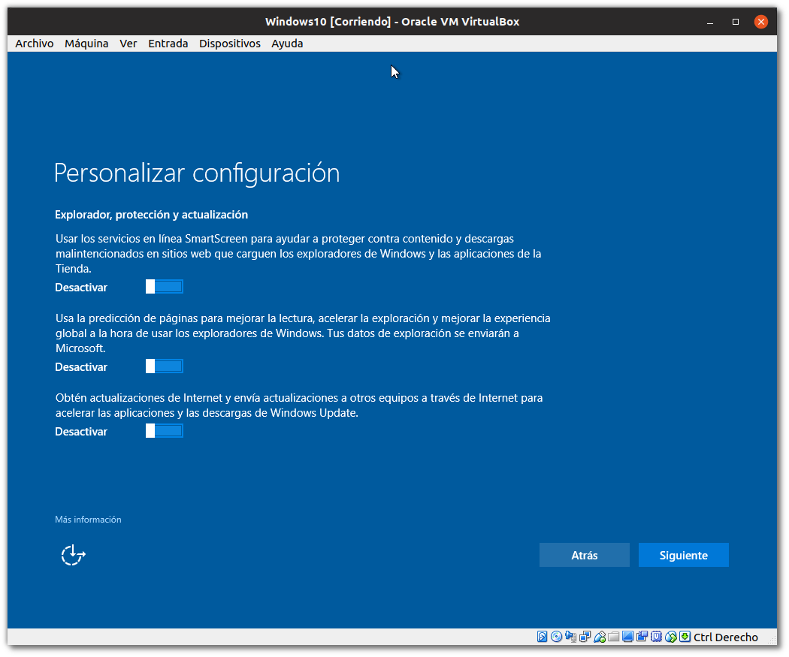

\newpage

## Gestión de usuarios

Es el momento de seleccionar como vamos a permitir a los usuarios iniciar sesión en el sistema. Tanto Windows como GNU/LinuX tiene muchos sistemas de autenticación de usuarios, por ahora vamos a utilizar los usuarios locales y será más adelante cuando configuremos un dominio para nuestra instalación y conectemos este sistema al dominio.

Seleccionaremos la opción:

**Unirse a un dominio de Active Directory Local**

### Creación de una cuenta

Crearemos ahora la cuenta del usuario administrador del equipo, luego podremos crear más administradores o modificarla, pero por ahora nos servirá para instalar y configurar el sistema.

Vamos a volver a utilizar el mismo usuario y password que hemos visto en la instalación de Xubuntu.

* Usuario: *adminiso*
* Password: *admin1s0*

\newpage

## Preparación del equipo

Una vez se haya creado el usuario, el sistema acabará de configurar todo el software y hardware que pueda de manera automática.

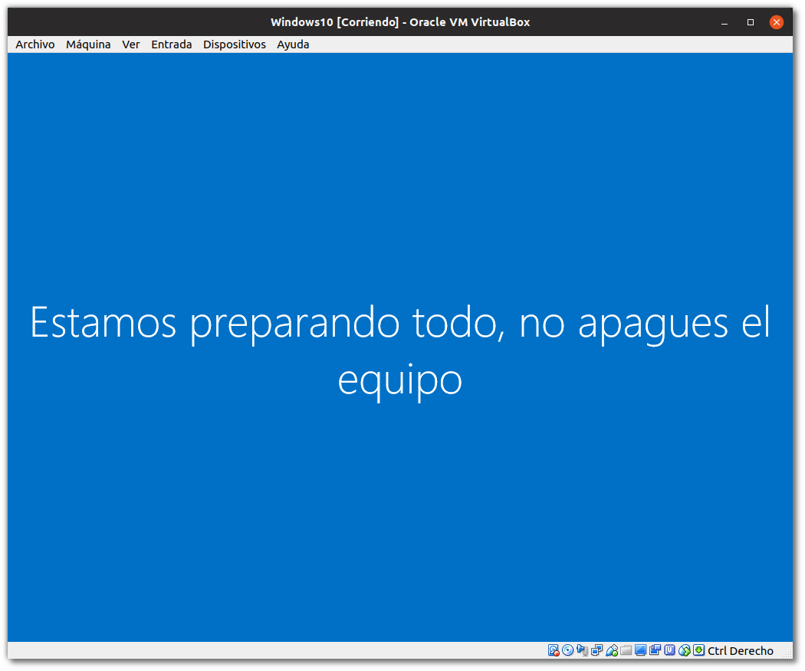

\newpage

# Escritorio

Cuando la instalación ha finalizado llegamos al *Escritorio de Windows*. Se trata de la ventana que nos muestra el sistema con una serie de *iconos* y *menús* que nos permitirán interactuar con el sistema.

Este escritorio puede variar de composición dependiendo de los dispositivos donde nos encontremos, así como de las versiones que instalemos. 

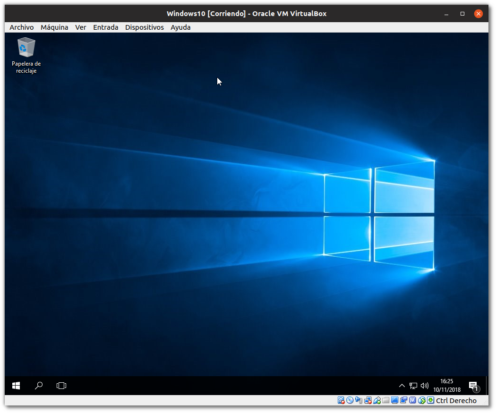

# Configuración básica

Si pulsamos la tecla *Win* o si hacemos clic en el icono que aparece abajo a la izquierda del escritorio, y a continuación pulsamos sobre la rueda dentada que aparece en el desplegable, o escribimos la palabra *configuración*, Windows nos abrirá el panel de configuración básica del sistema.

En este menú podremos realizar una gran cantidad de operaciones relacionadas con el sistema.

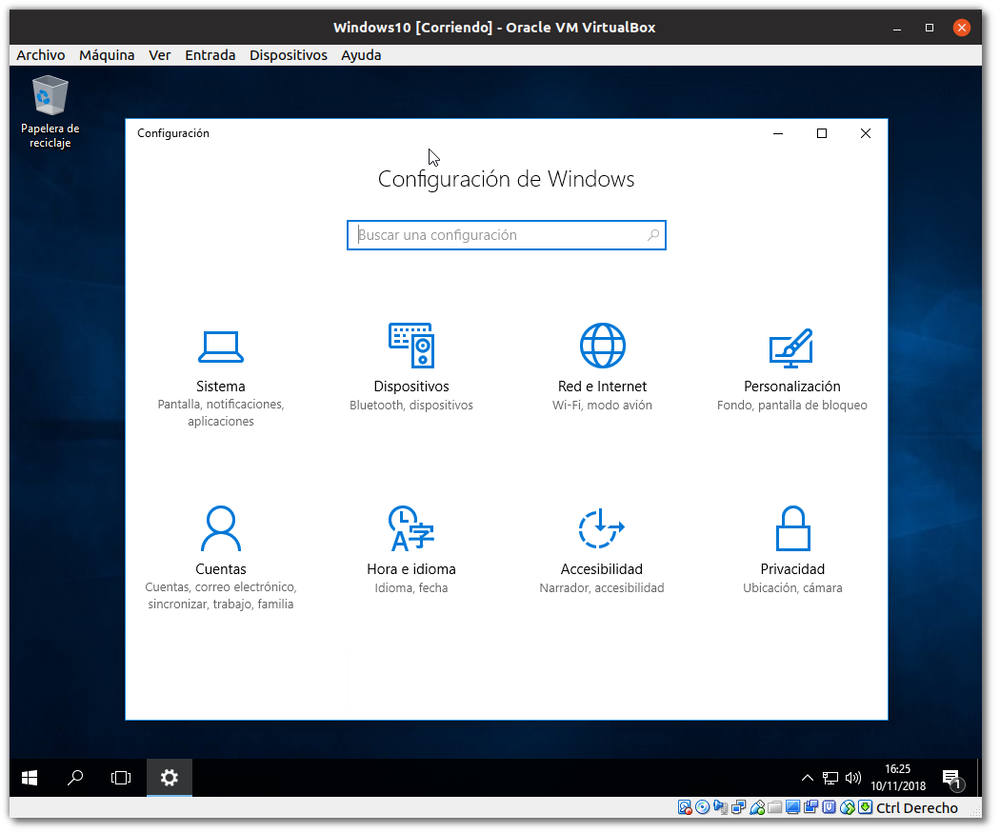

# Actualización y seguridad

Uno de los menús más importantes es el de *Actualización y seguridad*. En este menú podremos acceder a apartados como:

* Windows Update (Actualizaciones)
* Windows Defender (Antivirus)
* Copia de Seguridad
* Recuperación
* Activación de Windows
* Opciones para programadores (¡Nosotros!)
* Programa Windows Insider

## Activar Windows Ahora

En el caso de que no hayamos puesto clave de producto o hayamos puesto una que ya esté en uso, el sistema nos lo notificará y no se aplicarán las actualizaciones.

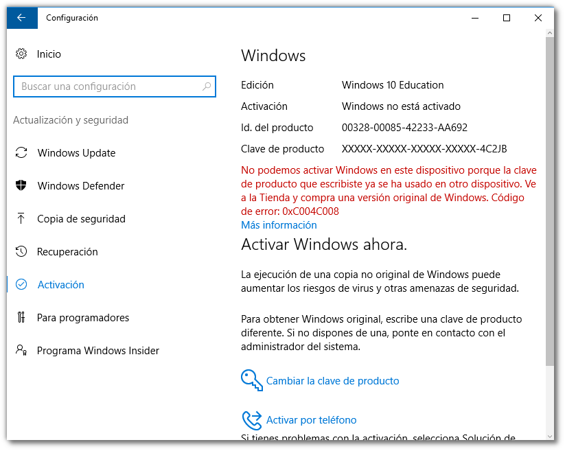

Es importante que los sistemas se encuentren actualizados, así que en el caso de que tengamos que activarlo, pulsaremos sobre la opción *Cambiar la clave de producto* e introduciremos una clave correcta.

Si la clave es correcta, Windows lo comprobará y se actualizará.

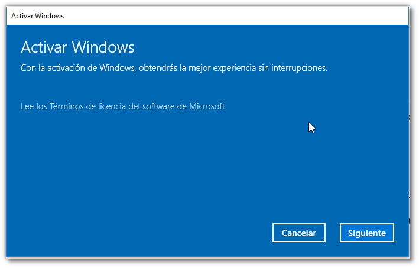

\newpage

## Buscar actualizaciones

Si acabamos de instalar, o activar, y no nos aparecen actualizaciones que aplicar, seguramente es porque no ha contactado con el servicio de actualizaciones de Microsoft, se puede forzar a que se busquen actualizaciones en línea pulsando el botón de *Buscar Actualizaciones*. 

Cuando realiza la búsqueda vemos que hay multitud de actualizaciones pendientes, así que lo dejaremos actualizando.

## Desarrolladores y PowerShell

En el apartado de Desarrolladores, podemos activar la ejecución de scripts locales, lo que nos permitirá ejecutar en el equipo los scripts que haremos más adelante. 

Si no deseamos activar esto, podremos hacerlo luego via script o nos pedirá confirmación para cada script.

