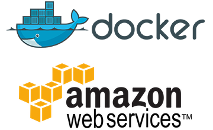

\newpage

# Virtualización en la nube 

Uno de los ejemplos más famosos de Virtualización en la Nube es Amazon EC2, esta tecnología permite a los usuarios alquilar computadores virtuales en los cuales pueden ejecutar sus propias aplicaciones. 

Este tipo de servicio supone un cambio en el modelo informático al proporcionar capacidad informática con tamaño modificable en la nube, pagando por la capacidad utilizada. Para ello utiliza capacidades escalado y elasticidad, que veremos más adelante.

En lugar de comprar o alquilar un determinado procesador para utilizarlo varios meses o años, en EC2 se alquila la capacidad por horas.

[Amazon ](https://aws.amazon.com/es/ec2/)

\

# Docker 

## ¿Qué son los contenedores?

Los contenedores proporcionan un entorno de ejecución aislado y coherente para las aplicaciones. El proyecto de código abierto Docker es una de las principales plataformas de administración de contenedores. Los contenedores de Docker proporcionan un enfoque eficaz y ligero para la implementación de aplicaciones, porque permiten que los distintos componentes de la aplicación se implementen de forma independiente en contenedores diferentes. En una única máquina puede haber varios contenedores y los contenedores se pueden mover entre equipos.

La portabilidad de los contenedores facilita la implementación de las aplicaciones en varios entornos, ya sean locales o en la nube, a menudo sin necesidad de modificar la aplicación.

# Escalabilidad

Se trata de la capacidad de aumentar o disminuir los recursos y servicios que va a usar en función de la demanda o la carga de trabajo siempre que quiera.

La informática en la nube admite el escalado vertical y horizontal, según sus necesidades.

## Escalado vertical

Es el proceso de agregar recursos para aumentar la potencia de un servidor existente. Algunos ejemplos de escalado vertical son agregar una CPU más rápida, CPU adicionales o más memoria.

## Escalado horizontal

Es el proceso de agregar más servidores que funcionen juntos como una unidad. Por ejemplo, en lugar de tener un servidor para procesar solicitudes entrantes, tiene dos.

Gráfico de crecimiento que representa la escalabilidad

El escalado se puede hacer de forma manual o automática basándose en desencadenadores específicos, como el uso de la CPU o el número de solicitudes, y los recursos se pueden asignar o desasignar en cuestión de minutos.

Herramientas como Kubernetes permiten realizar el escalado horizontal de manera más sencilla.

# Elasticidad

Cuando la carga de trabajo cambia debido a un aumento o disminución de la demanda, un sistema de informática en la nube puede compensarlo mediante la incorporación o la retirada automática de recursos.

Por ejemplo, imaginar que un sitio web aparece en un artículo de noticias, esto lleva a un aumento en el tráfico de la noche a la mañana. 

Como la nube es elástica, asigna automáticamente más recursos informáticos para controlar el incremento del tráfico. Cuando el tráfico comienza a asentarse, la nube avisa de que tiene demasiados recursos asignados y comienza a quitarlos.

Otro ejemplo es si está ejecutando una aplicación que usan los empleados de una empresa: Se puede hacer que la nube agregue recursos automáticamente durante las horas básicas que más usuarios acceden a la aplicación, y que los quite al final del día.

