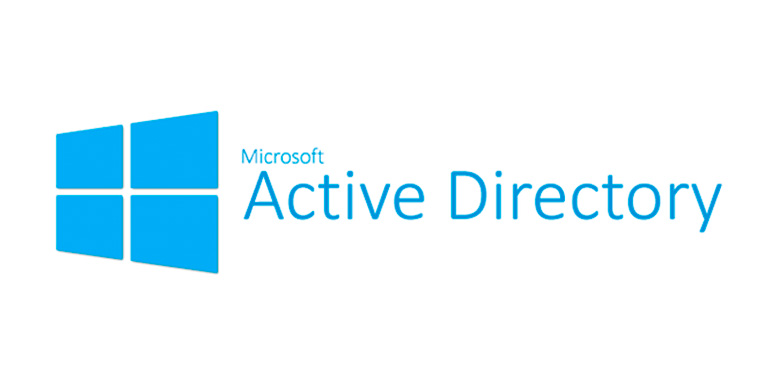
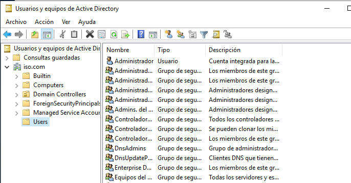
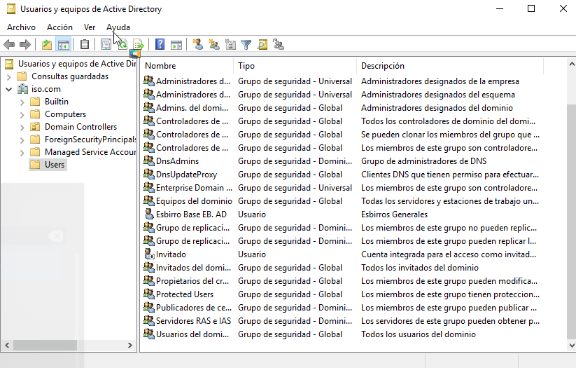

# Active Directory

\ 

Active Directory (AD) es el término que usa Microsoft para referirse a su implementación de servicio de directorio en una red de ordenadores, que puede ser distribuida. Utiliza distintos protocolos (como LDAP, DNS, DHCP,Kerberos, etc. que veremos a lo largo de la Unidad). Su estructura jerárquica permite mantener una serie de objetos relacionados con componentes de una red, como usuarios, grupos de usuarios, permisos y asignación de recursos y políticas de acceso.

Desde Windows Server NT se utiliza esta tecnología.

# Administración de Cuentas, Usuarios, Grupos y Equipos

## Administración de Usuarios

Las cuentas de usuario de _Active Directory_ representan entidades físicas (personas), pero también pueden ser utilizadas como cuentas de servicio para determinadas aplicaciones, al estilo UNIX de que los diferentes servicios de la máquina tienen asociado un usuario que es el que administra los permisos de los que dispone dicho servicio.

Otro nombre que podemos encontrar para referirnos a las cuentas de los usuarios es _entidades de seguridad_, que son objetos del directorio activo a los que se les asigna de manera automática identificadores de seguridad _(SID)_.

El uso habitual de las cuentas que administraremos  es el control de acceso de sesión en los equipos del dominio.

Un usuario que inicie sesión en la red (dominio), debe tener una cuenta de usuario propia y una contraseña que (_en principio_) solo debe conocer el usuario.

El uso compartido de cuentas no debe ser permitido, ya que dificulta el seguimiento y la auditoría de posibles incidencias relacionadas con la seguridad.

Una vez el usuario ha sido _autenticado_, se le concede o se le deniega el acceso a los recursos del dominio en función de los permisos explícitos que se le hayan asigando en el recurso.

## Creación de cuentas de usuario

En el menú de creación de usuarios si pulsamos botón derecho, nos aparecerá una opción de _nuevo_ y luego en el submenú
seleccionaremos el tipo de objeto que deseamos crear dentro del dominio.

Las características básicos para la creación de un usuario son las que hemos visto a lo largo de las Unidades anteriores
y además algunas propias de la gestión de usuarios dentro de un Directorio Activo.

Campo | Descripción 
---------|----------
 Nombre | Nombre del usuario
 Apellidos | Apellidos del usuario
 Iniciales | Iniciales del usuario
 Nombre Completo | Nombre completo del usuario
 Nombre de inicio de sesión | Login para el sistema (Acompañado del dominio)

A continuación se nos permite cambiar una serie de parámetros relacionados con la seguridad de la cuenta y con la contraseña.

## Restablecimiento de contraseña

No se permite obtener la contraseña de un usuario, es decir "recuperarla", ya que el sistema de cifrado no es reversible. Sin embargo en caso de que el usuario haya olvidado la contraseña, o necesitemos recuperarla por algún motivo, podemos _Restablecerle la contraseña_. De esta manera el usuario podrá entrar de nuevo en su cuenta y cambiar la contraseña a una que si recuerde.

## Copia de cuentas de usuario

Este es un mecanismo muy habitual en sistemas Windows para crear _usuarios plantilla_, de tal manera que luego podamos generar copias de ese usuario. Esto lo veremos con más profundidad en las prácticas de la unidad.

## Desplazar una cuenta de usuario

Podemos mover una cuenta de usuario a otro grupo o unidad organizativa, permitiendo así el desplazamiento _lógico_ de los usuarios dentro del dominio.

## Horas de inicio de sesión

Al igual que vimos en Unidades anteriores, podemos restringir las horas a las que determinadas cuentas pueden iniciar sesión en el dominio.

## Habilitar o deshabilitar

Podemos deshabilitar cuentas de usuario, lo que impide que inicien sesión pero mantenemos sus datos y configuraciones en el sistema.

## Eliminar una cuenta de usuario

También podemos eliminar la cuenta de usuario, borrando todos los datos y sus configuraciones.

## Grupo principal del usuario

Otra de las operaciones habituales que podemos realizar con los usuarios es asignarle otro **Grupo Principal**, de tal manera
que los permisos que se le apliquen serán distintos, así como las operaciones que pueda realizar.

# Grupos de Seguridad

Existen dos formas habituales de entidades de seguridad en Active Directory: cuentas de usuario y las cuentas de equipo. Estas cuentas representan una entidad física (una persona o un equipo). Las cuentas de usuario también pueden usarse como cuentas de servicio dedicadas para algunas aplicaciones. Los grupos de seguridad se usan para agrupar las cuentas de usuario, las cuentas de equipo y otros grupos en unidades fáciles de administrar.

En el sistema operativo de Windows Server, hay varias cuentas integradas y grupos de seguridad que están preconfigurados con los derechos y permisos adecuados para realizar tareas específicas.

Para Active Directory, hay dos tipos de responsabilidades administrativas:

**Los administradores de servicio**: se encargan de mantener y ofrecer Active Directory Domain Services (ADDS), como administrar controladores de dominio y configurar la agrega.

**Los administradores de datos**: se encargan de mantenimiento de los datos que se almacenan en agrega y en servidores miembro del dominio y las estaciones de trabajo.

Estos se gestionan mediante la pertenencia a diferentes _grupos de seguridad_.

## Tipos de Grupos

Los grupos se usan para administrar de manera más sencilla las cuentas de usuario, las cuentas de equipo y otros grupos. 

Trabajar con grupos en lugar de a usuarios individuales ayuda a simplifica la administración y mantenimiento de la red. Esto es indistinto de sistemas Windows o GNU/LinuX, tal y como hemos visto a lo largo del módulo.

Hay dos tipos de grupos en Active Directory:

**Grupos de distribución**:  Se usa para crear listas de distribución de correo electrónico.

**Grupos de seguridad**: Se usa para asignar permisos a los recursos compartidos.

### Grupos de distribución

Los grupos de distribución pueden usarse solo con las aplicaciones de correo electrónico (por ejemplo, Exchange Server) para enviar correo electrónico a grupos de usuarios. Los grupos de distribución no están habilitados en seguridad, con lo que no podrán tener acceso a las directivas de seguridad locales.

### Grupos de seguridad

Estos grupos proporcionan  una forma eficaz de asignar el acceso a los recursos de la red. 

Existen una serie de derechos de usuario que se asignan _automáticamente_ a varios grupos de seguridad cuando se instala ActiveDirectory para ayudar a los administradores definir el rol administrativo de una persona en el dominio.

Mediante el uso de grupos de seguridad, puedes:

* Asignar derechos de usuario a grupos de seguridad de Active Directory.
Los derechos de usuario se asignan a un grupo de seguridad para determinar lo que pueden hacer los miembros de ese grupo dentro del ámbito de un dominio o bosque. 

* Se pueden usar `Politicas de Grupo` para asignar permisos de usuario a grupos de seguridad para delegar tareas específicas.

* Asignar permisos a grupos de seguridad para los recursos.

* Mediante el uso de los grupos de seguridad podemos restringir el uso a los diferentes recursos compartidos de la red, estableciendo los permisos que correspondan a los diferentes grupos, lectura, escritura, etc.

* Al igual que los grupos de distribución, los grupos de seguridad pueden usarse como una entidad de correo electrónico. Enviar un mensaje de correo electrónico al grupo, envía el mensaje a todos los miembros del grupo.

Tal y como hemos dicho anteriormente existen una serie de grupos que se crean de manera automática cuando instalamos un dominio.

\

En las prácticas veremos más detalladamente estos grupos.

# Ámbito de los grupos

Los grupos se caracterizan por un _ámbito_ que identifica la extensión al que se aplica el grupo en el árbol de dominio o bosque. 

Existen tres posibles ámbitos para un grupo:

* Universal
* Global
* Dominio Local

Además de estos tres ámbitos,los grupos predeterminados que hemos visto antes (los que se crean al inicializar el dominio), tienen un ámbito de grupo _Local_. No se puede cambiar su tipo y ámbito.

## Grupo Local

Los miembros de este grupo pueden proceder de cualquier dominio, pero sólo pueden acceder a los recursos de Windows en el dominio local.

Se utiliza este ámbito para conceder permisos a los recursos de dominio que se encuentran en el mismo dominio en el que ha creado el grupo local de dominio. 

Los grupos locales de dominio pueden existir en todos los niveles funcionales de dominios y bosques.

**Restricción**: no se puede definir anidamiento de grupo en un grupo local de dominio. Un grupo local de dominio no puede ser miembro de otro grupo local de dominio o de cualquier otro grupo del mismo dominio.

## Grupo Global

Los miembros de este grupo se originan a partir de un dominio local, pero pueden acceder a los recursos de cualquier dominio. 

El grupo global se utiliza para organizar los usuarios que comparten requisitos similares de acceso en diferentes redes. 

Se pueden añadir miembros sólo desde el dominio en el que se crea el grupo global. 

Se puede utilizar este grupo para asignar los permisos de acceso a los recursos compartidos que están ubicados en cualquier dominio del dominio, árbol o bosque.

Al agrupar usuarios con funciones similares bajo un ámbito global y otorgar permisos se permite acceder a recursos, como una impresora o carpetas y archivos compartidos, que están disponibles en un dominio local o en otro dominio del mismo bosque.

Es posible el anidamiento para los grupos globales dentro de otros grupos ya que puede añadir un grupo global a otro grupo global desde cualquier dominio.

**Restricción**: Se permite agregar cuentas de usuario y grupos globales sólo desde el dominio en el que se crea el grupo global.

## Grupos Universales

Los miembros de este grupo pueden proceder de cualquier dominio y acceder a los recursos de Windows de diversos dominios.

La pertenencia a grupos universales no está limitada como en los grupos globales. Todas las cuentas de usuario y los grupos del dominio pueden ser miembros de un grupo universal.
